# PicFrame Architecture Documentation

## System Overview

PicFrame is a sophisticated digital picture frame application built on the pi3d graphics library, designed primarily for Raspberry Pi devices. The system provides advanced image and video display capabilities with extensive smart home integration through MQTT and HTTP interfaces.

### Key Features
- **Advanced Image Processing**: Support for multiple formats including HEIF/HEIC, with automatic rotation, matting, and Ken Burns effects
- **Video Support**: Full video playback with VLC integration
- **Smart Home Integration**: Native Home Assistant integration via MQTT discovery protocol
- **Multiple Control Interfaces**: MQTT, HTTP REST API, keyboard, touch, and mouse input
- **Geolocation Services**: Automatic location tagging using reverse geocoding
- **Database-Driven**: SQLite-based image cache with metadata extraction
- **Configurable Display**: Flexible text overlays, clock display, and visual effects

## MVC Architecture Pattern Implementation

PicFrame follows a clean Model-View-Controller (MVC) architecture pattern that separates concerns and enables maintainable, extensible code.

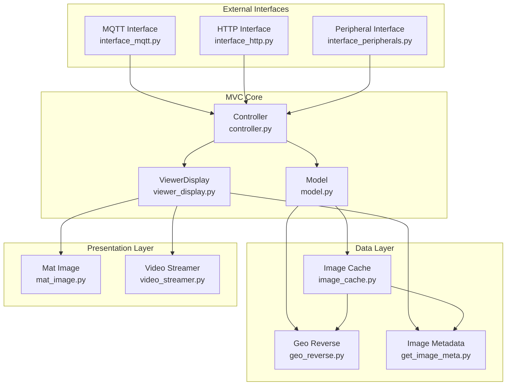

### Model (model.py)
**Responsibilities:**
- Configuration management and validation
- Business logic for image selection and filtering
- Database query orchestration
- File system monitoring and management
- State management for display properties

**Key Components:**
- `Pic` class: Data structure representing image metadata
- Configuration loading and validation from YAML
- Image filtering logic (location, tags, date ranges)
- File list management with shuffle and sorting capabilities
- Integration with ImageCache for data persistence

### View (viewer_display.py)
**Responsibilities:**
- Graphics rendering using pi3d
- Image and video display management
- Text overlay rendering
- Visual effects (Ken Burns, transitions, matting)
- Display power management

**Key Components:**
- pi3d integration for hardware-accelerated graphics
- Image transformation and scaling algorithms
- Text rendering with configurable fonts and positioning
- Video playback integration with VLC
- Transition effects and timing management

### Controller (controller.py)
**Responsibilities:**
- Orchestrating interactions between Model and View
- Handling user input from all interface types
- Managing application lifecycle and timing
- State synchronization across interfaces
- Error handling and recovery

**Key Components:**
- Main application loop with timing control
- Property-based interface for external control
- Signal handling for graceful shutdown
- Interface coordination (MQTT, HTTP, peripherals)

## Data Flow Diagrams

### Image Processing Pipeline

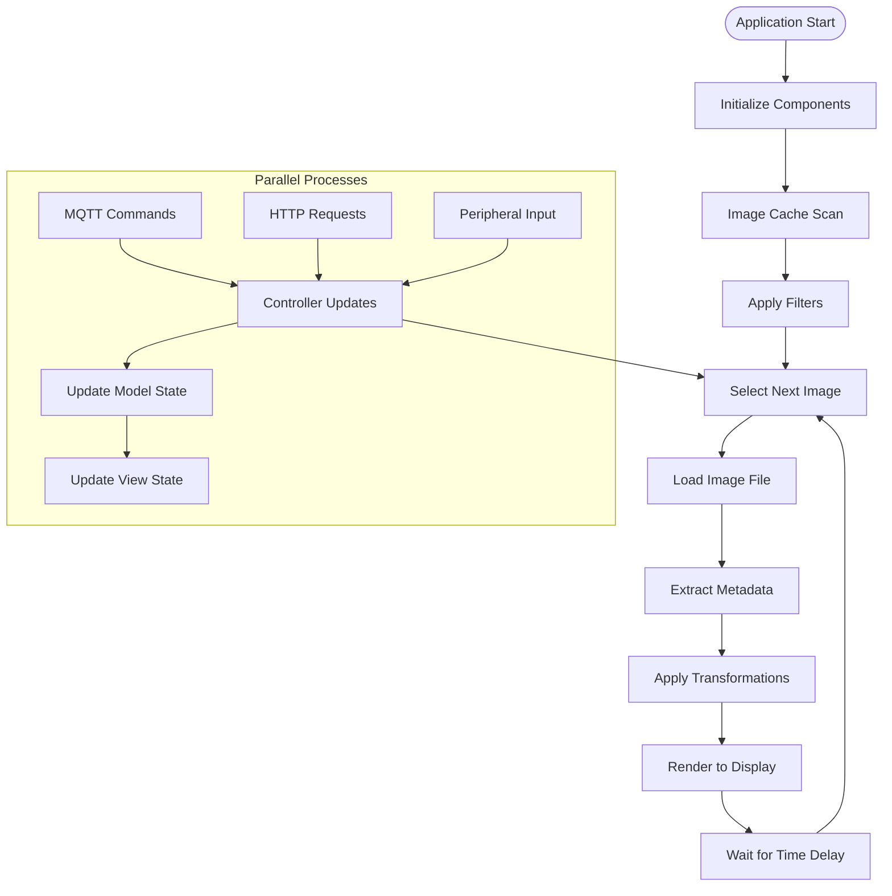

### Database Update Flow

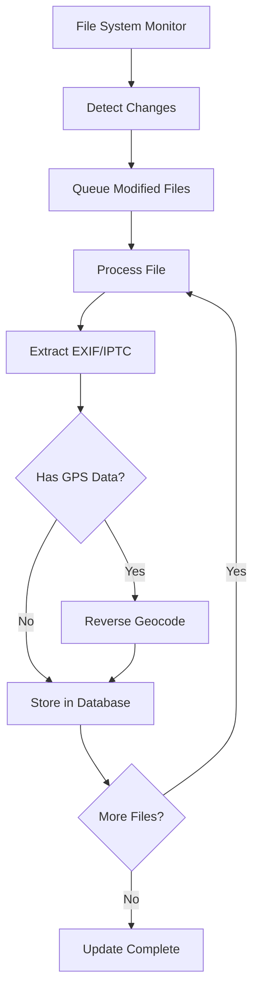

### Video Processing Pipeline

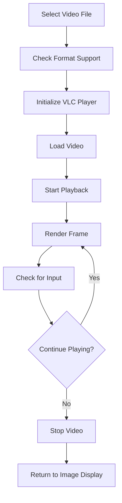

## Integration Patterns

### MQTT Integration Pattern

The MQTT interface implements the Home Assistant MQTT Discovery protocol for seamless smart home integration.

**Architecture:**
- **Discovery Protocol**: Automatic device registration with Home Assistant
- **State Synchronization**: Bidirectional state updates between PicFrame and Home Assistant
- **Entity Types**: Sensors, switches, buttons, numbers, selects, and text inputs
- **Availability Tracking**: Last Will and Testament for connection status

**Topic Structure:**
```
homeassistant/{component}/{device_id}_{entity}/config  # Discovery
homeassistant/{component}/{device_id}_{entity}/state   # State updates
{device_id}/{entity}                                   # Commands
```

**Key Features:**
- Automatic entity creation in Home Assistant
- Real-time state synchronization
- Comprehensive device information
- Graceful connection handling with reconnection logic

### HTTP Interface Pattern

The HTTP interface provides a RESTful API for web-based control and integration.

**Architecture:**
- **RESTful Design**: GET/POST requests for state queries and updates
- **Authentication**: Optional HTTP Basic Authentication
- **Static File Serving**: Web interface hosting
- **Real-time Image Access**: Current image streaming endpoint

**API Patterns:**
```
GET /?all                           # Get all current states
GET /?{property}                    # Get specific property value
POST /?{property}={value}           # Set property value
GET /current_image                  # Stream current image
GET /{static_file}                  # Serve static web files
```

**Security Features:**
- Optional HTTP Basic Authentication
- SSL/TLS support with certificate configuration
- Input validation and sanitization
- Configurable access controls

### Peripheral Interface Pattern

The peripheral interface provides direct hardware input support for standalone operation.

**Architecture:**
- **Input Abstraction**: Unified handling of keyboard, touch, and mouse input
- **Menu System**: pi3d-based GUI with configurable buttons
- **Navigation Areas**: Screen regions for image navigation
- **Power Management**: Display control integration

**Input Handling:**
- **Keyboard**: Direct key mapping with shortcuts
- **Touch**: Gesture-based navigation with menu overlay
- **Mouse**: Pointer-based interaction with hover effects
- **Menu System**: Configurable action buttons with visual feedback

## Component Interactions

### Startup Sequence

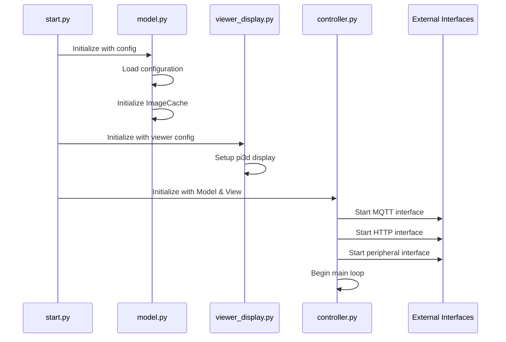

### Image Display Cycle

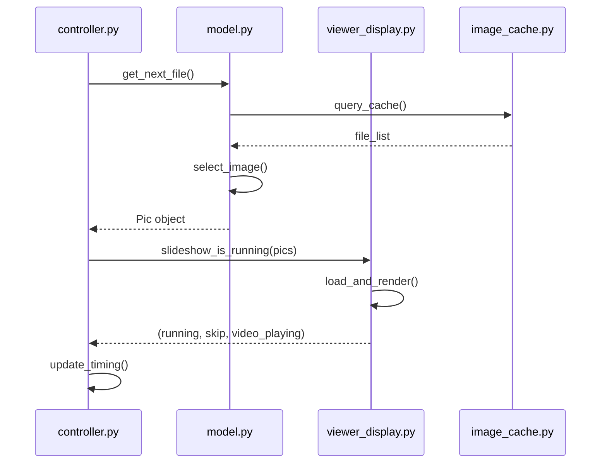

### External Command Processing

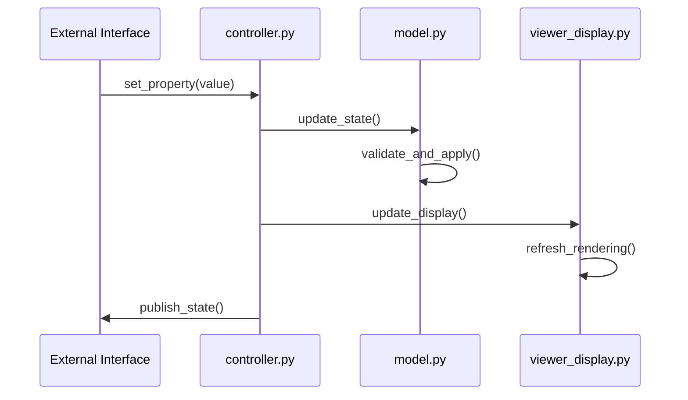

## Configuration Architecture

PicFrame uses a hierarchical YAML configuration system with sensible defaults and validation.

### Configuration Structure
```yaml
viewer:          # Display and rendering settings
model:           # Business logic and data settings  
mqtt:            # MQTT integration settings
http:            # HTTP interface settings
peripherals:     # Hardware input settings
```

### Configuration Loading Process
1. **Default Configuration**: Built-in defaults ensure system functionality
2. **File Loading**: YAML configuration file parsing with error handling
3. **Validation**: Type checking and range validation
4. **Merging**: Section-wise merging with defaults
5. **Expansion**: Path expansion and environment variable resolution

## Error Handling Strategy

### Graceful Degradation
- **Missing Files**: Automatic fallback to "no images" display
- **Network Failures**: Continue operation without external interfaces
- **Hardware Issues**: Fallback display modes and input methods

### Logging Architecture
- **Hierarchical Loggers**: Module-specific logging with configurable levels
- **File and Console Output**: Flexible logging destination configuration
- **Error Recovery**: Automatic retry mechanisms for transient failures

### Resource Management
- **Database Connections**: Proper connection lifecycle management
- **Graphics Resources**: pi3d resource cleanup and memory management
- **Thread Safety**: Synchronized access to shared resources

## Performance Considerations

### Image Processing Optimization
- **Caching Strategy**: Multi-level caching for images and metadata
- **Lazy Loading**: On-demand image processing and loading
- **Memory Management**: Efficient texture management in pi3d
- **Background Processing**: Asynchronous metadata extraction

### Database Performance
- **Indexing Strategy**: Optimized database indexes for common queries
- **Query Optimization**: Efficient SQL queries with proper WHERE clauses
- **Connection Pooling**: Managed database connection lifecycle
- **Batch Processing**: Bulk operations for file system updates

### Network Optimization
- **Connection Management**: Persistent connections with reconnection logic
- **Message Batching**: Efficient MQTT message handling
- **Compression**: Image compression for HTTP streaming
- **Caching Headers**: Proper HTTP caching for static resources

This architectural documentation provides a comprehensive overview of PicFrame's design, implementation patterns, and system interactions. The MVC pattern ensures clean separation of concerns, while the multiple integration interfaces provide flexible control options for various deployment scenarios.
##
 Detailed Component Diagrams

### Core System Components

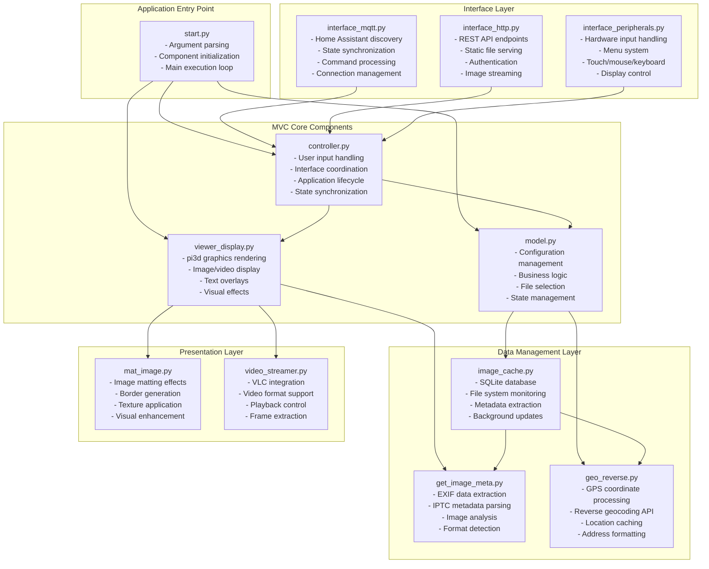

### Database Schema and Relationships

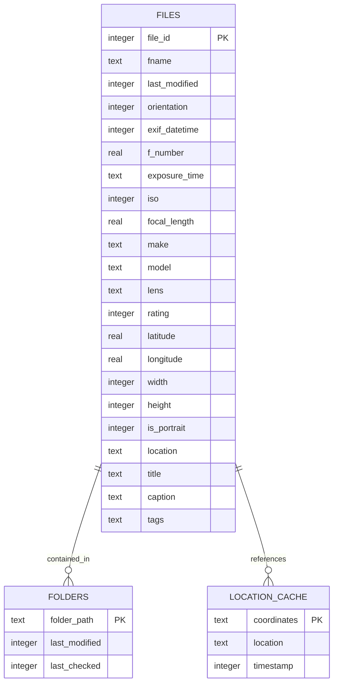

### Interface Communication Patterns

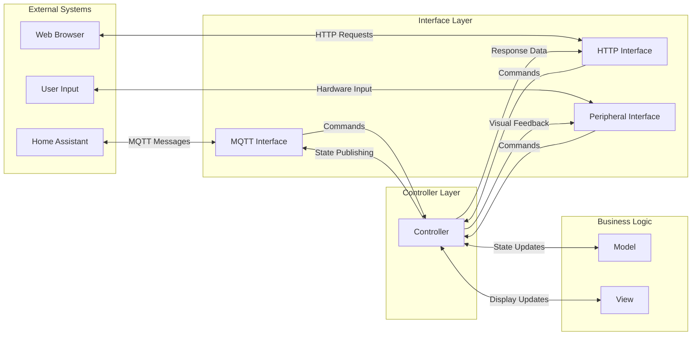

## Threading and Concurrency Model

### Thread Architecture

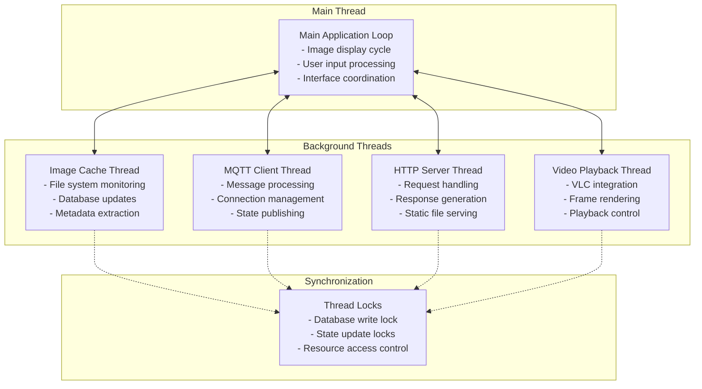

### Synchronization Mechanisms

1. **Database Write Lock**: Serializes database write operations across threads
2. **State Update Coordination**: Ensures consistent state across interfaces
3. **Resource Access Control**: Manages shared resources like display and files
4. **Graceful Shutdown**: Coordinated thread termination on application exit

## Memory Management Strategy

### Image Memory Management

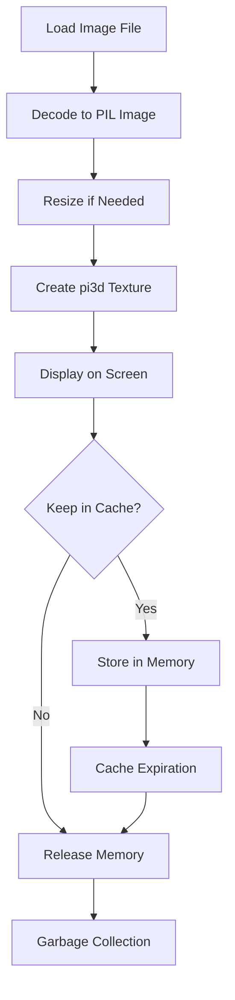

### Resource Lifecycle Management

1. **Texture Management**: Automatic cleanup of pi3d textures
2. **Database Connections**: Proper connection lifecycle with cleanup
3. **File Handles**: Automatic file handle management with context managers
4. **Memory Monitoring**: Periodic memory usage assessment and cleanup

## Security Architecture

### Authentication and Authorization

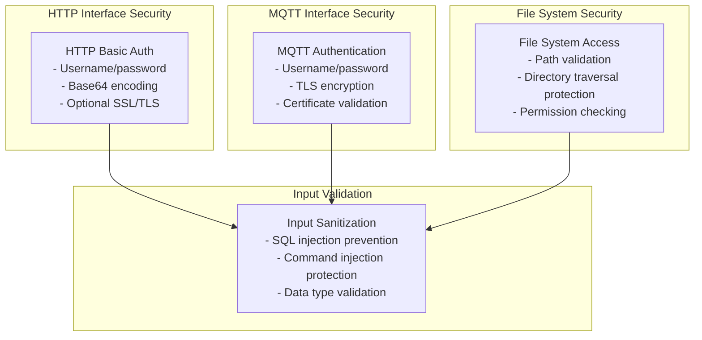

### Security Measures

1. **Input Sanitization**: All user inputs are validated and sanitized
2. **Path Validation**: File system access is restricted to configured directories
3. **Authentication**: Optional but recommended authentication for remote interfaces
4. **Encryption**: TLS/SSL support for secure communication
5. **Permission Management**: Proper file system permission handling

## Deployment Architecture

### Raspberry Pi Deployment

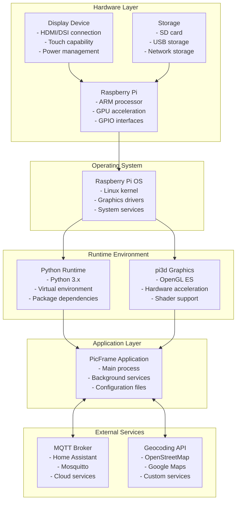

### System Integration Points

1. **Hardware Integration**: Direct hardware access for display and input
2. **Service Integration**: Systemd service configuration for automatic startup
3. **Network Integration**: WiFi/Ethernet connectivity for remote interfaces
4. **Storage Integration**: Flexible storage options for images and database
5. **Power Management**: Display power control and system power management

This comprehensive architectural documentation covers all aspects of the PicFrame system, from high-level design patterns to detailed implementation specifics. The documentation serves as a complete reference for understanding the system's structure, data flows, and integration patterns.